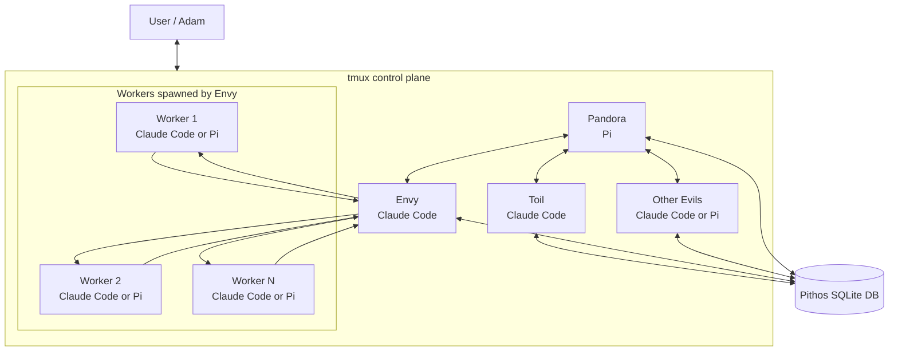

# Pandora's Box - agent orchestration tool

> [...] after a while I realized I just wanted someone to talk to, while the system was working. And perhaps, as occasion might demand, someone to yell at.
>
> -- Steve Yegge: [Gas Town: from Clown Show to v1.0](https://steve-yegge.medium.com/gas-town-from-clown-show-to-v1-0-c239d9a407ec)

## About

Pandora's Box is a multi-agent orchestration system. You talk to a primary agent, **Pandora**, who delegates work to specialist agents called the **Evils** — each handling a focused role such as triage, design, or implementation.

The system stays visible and steerable. Pandora is the main interface, but you can inspect or interact with any agent in the orchestra directly when needed.

`tmux` is the current control plane; shared state and coordination live in the Pithos SQLite store. The control-plane layer is intended to stay replaceable, so agents do not depend on tmux-specific mechanics. Supported harnesses today: Claude Code and Pi.



## Packages

- **`pithos`** — the state CLI. Owns the SQLite store, queue, leases, events, artifacts, and briefing.
- **`pandora-spawn`** — the agent spawner. Owns templates, manifest config, launcher recipes, hooks, and harness argv construction.
- **`pdx`** — the local supervisor. Owns daemon lifecycle, tmux ownership, structured supervisor logs, operator status, and local control-plane IPC.

Agents register runs, claim fenced tasks, heartbeat, attach artifacts, and complete or fail — all through `pithos`. Nothing else writes to the database.

Supported harnesses:

- Claude Code (`--harness claude`)
- Pi (`--harness pi`)

## Quick start

Prereqs: `tmux` plus at least one supported harness CLI on PATH (`claude`, `pi`, or both).

```sh
pnpm install
pnpm run build      # builds workspace packages and links pithos + pithos-next + pandora-spawn + pdx on PATH
pithos --help
pithos-next init --fresh
PITHOS_BIN=pithos-next pandora-spawn preview --agent pandora --mode hitl --scope global --run run_PREVIEW --session-id session_PREVIEW --cwd ~/.pandora
PITHOS_BIN=pithos-next pdx open
```

`pdx open` is the current local control-plane entrypoint. `pandora-spawn preview ...` remains the supported launcher validation path.

### Harness hooks

Real spawned sessions rely on tiny harness adapters for one job:

- **liveness** — native harness activity becomes `pithos task heartbeat --run ...`

Claude Code and Pi use different native hook APIs, but both forward into the same shared dispatcher. The adapters no-op in normal non-Pithos sessions because `pandora-spawn` only activates them when it injects the required `PITHOS_*` environment. Run finalization stays with `pdx`; the hooks do not close runs.

Install per harness:

- **Claude Code** — install the marketplace plugin once:

  ```sh
  /plugin marketplace add https://github.com/codethread/pithos
  /plugin install pithos@codethread/pithos
  ```

  Plugin details: [`packages/spawner/claude-plugin/README.md`](packages/spawner/claude-plugin/README.md).

- **Pi** — spawned sessions inject the extension automatically. Manual/dev install: [`packages/spawner/pi-extension/README.md`](packages/spawner/pi-extension/README.md).

Shared hook details: [`packages/spawner/README.md#harness-hooks`](packages/spawner/README.md#harness-hooks).

## Agent model

All agents are visible through the control plane: tmux-backed sessions plus JSONL session logs. The state layer is deliberately separate from the harness.

Agents fall into two categories:

- **AFK** — away from keyboard. Cheap; we want as many of these as possible.
- **HITL** — human-in-the-loop. Expensive but important.

The point of Pandora's Box is to distill HITL time, maximising busy work while the human provides clear direction.

### Implemented roster

| Agent   | Type | Claims      | Current harness | Role                                                                   |
| ------- | ---- | ----------- | --------------- | ---------------------------------------------------------------------- |
| Pandora | HITL | —           | Pi              | Global orchestrator. Delegates, inspects, asks questions.              |
| Toil    | AFK  | `triage`    | Claude Code     | Breaks goals down, finds repos, enqueues concrete work.                |
| Greed   | HITL | `design`    | Pi              | Design/research partner for risky or unclear work.                     |
| Envy    | AFK  | `implement` | Claude Code     | Coordinator. Claims implementation work, spawns workers, reports back. |
| Worker  | AFK  | —           | Claude Code     | Ephemeral executor. Performs repo/worktree mutation, reports, exits.   |

### Delegation chain

```text
Adam
 │  high-level goal
 ▼
Pandora ─── orchestrates, never owns queue work directly
 │  if scope unknown: spawns Toil in ~/.pandora to break it down
 │  if scope known: goes straight to per-repo Toil
 ▼
Toil ─── discovers repos, decomposes work, enqueues queue-facing tasks
 │
 ▼
Envy ─── claims implement work, spawns workers, watches, reports
 │
 ▼
Workers ─── perform the actual repo/worktree mutation
```

Each handoff is deliberate: Pandora should not burn context on repo discovery, and War should not burn context on planning outside her `execute` remit.

### Claim routing

Queue capabilities describe the requested outcome class, not the agent's internal execution style. Pandora does not claim queue work — she coordinates across scopes and capabilities.

```text
pithos enqueue --capability triage    -> Toil claims
pithos enqueue --capability design    -> Greed claims
pithos enqueue --capability execute   -> War claims
pithos enqueue --capability escalate  -> Pandora claims
```

### Per-agent notes

- **Pandora** — the human-facing bridge. Consumes briefings, inspects tasks/runs/artifacts, decides where attention is needed, and spawns the right specialist. Owns `escalate`.
- **Toil** — in `~/.pandora` she does broad repo discovery and breakdown; in a concrete repo scope she turns goals into actionable queue work and then exits. Owns `triage`.
- **Greed** — design-quality agent. Owns `design`, explores code deeply, interviews Adam one question at a time, and records the outcome as a `design-brief` artifact.
- **War** — execution agent. Owns `execute`, performs repo/worktree mutation in scope, records the result as a `war-completion` artifact, and escalates when human attention is needed.

## Documents

| File                                       | Purpose                                                                |
| ------------------------------------------ | ---------------------------------------------------------------------- |
| `AGENTS.md`                                | Non-negotiable engineering rules                                       |
| `CONTRIBUTING.md`                          | Setup, verify, commit hygiene, doc map                                 |
| `packages/cli/README.md`                   | `pithos` CLI surface and runtime contract                              |
| `packages/cli/CONTRIBUTING.md`             | CLI package quality bar and add-a-command checklist                    |
| `packages/spawner/README.md`               | `pandora-spawn` preview CLI, launcher library API, manifests, harnesses |
| `packages/spawner/CONTRIBUTING.md`         | Spawner package constraints and change checklist                       |
| `packages/pdx/README.md`                   | `pdx` daemon surface, local supervision, and operator commands         |
| `packages/pdx/CONTRIBUTING.md`             | pdx package constraints and change checklist                           |
| `packages/spawner/claude-plugin/README.md` | Claude Code plugin install/use                                         |
| `packages/spawner/pi-extension/README.md`  | Pi extension install/use                                               |
| `references/README.md`                     | Copied prior art; read-only reference behaviour                        |
| `.claude/commands/smoke.md`                | Claude Code manual smoke-test command                                  |
| `.pi/prompts/smoke.md`                     | Pi manual smoke-test prompt                                            |

When in doubt: read the code for exact behavior, the package READMEs for the supported surface, and `AGENTS.md` for engineering invariants.
