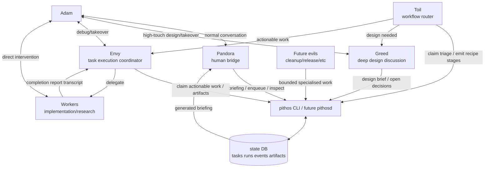

# Pithos ambition

**Status:** Planned  
**Last Updated:** 2026-05-01

## 1. Overview

### Purpose

Pithos is the planned local control-plane for Pandora's Box: a visible, inspectable, human-steerable multi-agent system where Adam primarily talks to Pandora, while specialised agents coordinate design, triage, execution, monitoring, and cleanup.

This document records the direction beyond the MVP. It is intentionally lighter than the MVP and technical design specs. The MVP should remain small; this spec explains what the small pieces are aiming toward.

### Goals

- Keep Pandora as Adam's primary eyes, ears, and conversational bridge.
- Give Pandora reliable briefings instead of forcing her to personally remember raw queues and session state.
- Let specialised evils do bounded jobs: Toil dispatches, Greed designs, Envy coordinates execution, future agents handle cleanup or other repeated roles.
- Preserve human inspectability: Adam can talk to any agent or inspect any task/run, but does not have to.
- Improve code quality by routing unclear work to design-heavy Greed sessions before implementation.
- Make workflows reusable through recipes without baking each workflow into engine code.
- Grow from explicit/manual spawning toward more automatic lifecycle management only after the primitives prove useful.

### Non-Goals

- Pithos should not become a dark autonomous factory.
- Pithos should not hide agents or make human takeover difficult.
- Pithos should not optimise for maximum parallelism at the cost of reviewability.
- Pithos should not move judgement into a non-LLM daemon.
- Pithos should not require every worker to understand the control-plane protocol.
- Pithos should not add scheduler/recipe complexity before real workflows demand it.

## 2. Design Direction

- **Decision:** Pandora remains the face of the system.
  - **Rationale:** Adam's default workflow should stay conversational. Pandora interprets briefings, asks questions, and helps decide where human attention is needed.

- **Decision:** Pithos is the nervous system, not the brain.
  - **Rationale:** The database/CLI/harness track tasks, runs, leases, events, and artifacts. Agents do judgement and interpretation.

- **Decision:** Agent work should be bounded by default.
  - **Rationale:** Task-scoped Toil, Greed, and Envy runs avoid context bloat, reduce responsibility bleed, and naturally pick up updated recipes/prompts on the next spawn.

- **Decision:** Design discussion is first-class.
  - **Rationale:** The goal is better work, not faster garbage. Greed exists for deep repo exploration and heavy human-in-the-loop design before execution.

- **Decision:** Work routes to scopes/capabilities before named agents.
  - **Rationale:** A task should target `repo:work/... + watch/design/triage`, allowing the implementation agent to change over time. Direct agent messages remain an escape hatch.

- **Decision:** Workers stay mostly isolated from Pithos.
  - **Rationale:** Ordinary implementation agents should focus on their task and final report. Envy/wrappers translate worker transcripts into Pithos artifacts and lifecycle state.

- **Decision:** Recipes and Skills are the extension points.
  - **Rationale:** New ways of working should usually mean editing a recipe, agent file, or Skill — not changing scheduler/database code.

## 3. Target Architecture

## 4. Agent Ambitions

### Pandora

Pandora becomes more of a bridge between Adam and the workload than a task processor.

Longer-term behaviour:

- consumes generated briefings
- answers sitrep from facts in Pithos
- asks Adam focused questions
- routes goals into Pithos/Toil
- helps Adam choose when to inspect Greed/Envy/workers directly
- does not personally track every worker session in context

### Toil

Toil processes Pandora-facing queues into structured work.

Longer-term behaviour:

- short-lived or bounded runs
- reads recipes and dispatches stages
- creates Greed tasks for design-heavy work
- creates Envy tasks for actionable execution
- caps emitted tasks to avoid task spam
- perishes after dispatching a small unit of work

### Greed

Greed is the design-quality agent.

Longer-term behaviour:

- spawned for unclear, risky, cross-repo, or PRD-heavy work
- greedily absorbs repo/domain context
- has heavy back-and-forth with Adam
- asks one focused question at a time after exploration
- produces a shared design brief before implementation
- records risks, rollout plans, open decisions, and impacted repos

### Envy

Envy is the task-scoped execution coordinator.

Longer-term behaviour:

- one Envy run per watch/coordination task by default
- may spawn zero or many workers
- watches worker status/transcripts
- converts worker reports into artifacts
- completes/fails its task and exits
- multiple Envy runs may exist for one repo without sharing context

### Future evils

Future agents should be added when a repeated role becomes clear.

Possible examples:

- cleanup/restart reviewer for ambiguous stale sessions
- release coordinator
- review aggregator
- CI/pipeline monitor
- documentation/refinement specialist

Deterministic lifecycle cleanup should remain in `pithos sweep` / future `pithosd`; LLM agents should handle judgement-heavy decisions, not cron work.

## 5. Recipes and Workflows

Recipes describe reusable ways of working across repos. They are not engine code.

Likely recipes:

- protobuf release/update chain
- PRD to design to implementation
- multi-repo feature rollout
- CI failure investigation
- dependency upgrade chain
- release coordination

Example ambition for a protobuf workflow:

The ambition is that recipes eventually produce workflow instances with visible stages, gates, blockers, and child tasks. MVP does not implement this interpreter.

## 6. Visibility and Inspection

Pandora should use progressive disclosure:

1. `pithos briefing --agent pandora` — concise sitrep.
2. `pithos inspect task ...` — details for one task/workflow.
3. `pithos inspect run ...` — session IDs, tmux target, cwd, heartbeat.
4. Future `pithos status run ...` — recent Claude transcript/status tail.
5. Direct tmux/agent takeover — high-cost human intervention.

Expected sitrep style:

> protobuf has 3 active tracks: one ready for review, one waiting on CI, and one multi-step chain with 2/5 subtasks done. Want the detailed trace or just ready-for-review items?

## 7. Lifecycle Ambition

### MVP

- explicit spawning by Adam/Pandora/Toil/Envy/wrappers
- `pithos sweep` for stale leases/runs
- no daemon
- no auto-spawn

### Later

A future `pithosd` may reconcile desired state:

- queued work exists for a scope/capability
- matching agent is absent or stale
- spawn/nudge the correct agent
- register run
- keep lifecycle visible

`pithosd` must remain boring. It may start, wake, mark stale, and clean up deterministic lifecycle state. It must not plan, prioritise, or interpret work.

## 8. Data Ambition

MVP uses SQLite. Dolt remains a possible future option if versioned state becomes genuinely useful.

Potential future additions:

- workflow instances/stages
- subscriptions/capability registry
- direct messages
- richer artifacts
- status/transcript indexing
- dashboards
- generated repo-local debug views

Each addition should pass the simplicity test:

> Can this be represented as task/run/event/artifact rows plus recipe/Skill config? If yes, do not add engine code yet.

## 9. Growth Principles

- Add primitives only after a manual workflow hurts.
- Prefer explicit commands before daemons.
- Prefer recipes/Skills before engine code.
- Prefer task-scoped agents before persistent agents.
- Prefer generated briefings before raw context injection.
- Prefer human-visible artifacts over hidden agent memory.
- Prefer narrow workers over pbox-aware workers.
- Stop and record friction before adding each layer.
