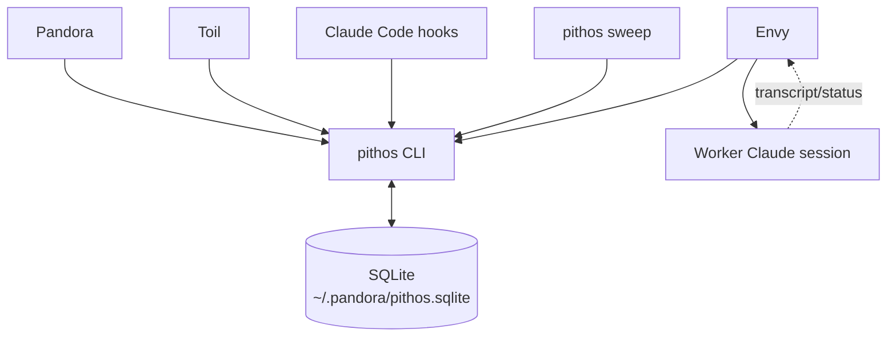
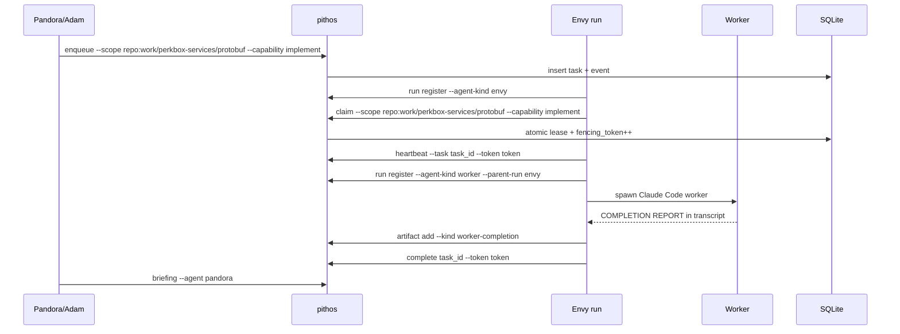

# Pandora Box technical design

**Status:** Partial  
**Last Updated:** 2026-05-03

## 1. Overview

### Purpose

This document defines the absolute MVP technical design for a new dedicated `pithos` repository. The goal is to build the smallest reliable control-plane primitive set: a local SQLite DB, a `pithos` CLI, task leases with fencing, Claude Code run tracking, and generated briefings.

The implementation should be built from scratch. Existing `pandora/bin/*` scripts are prior art only.

### Goals

- Implement a tested local `pithos` CLI.
- Store state in SQLite at `~/.pandora/pithos.sqlite` by default.
- Support one manual end-to-end loop: enqueue → claim → heartbeat → complete/fail → briefing.
- Track Claude Code runs with environment variables and hook scripts.
- Keep workers pithos-tracked but not pithos-aware.
- Keep recipes, Claude Code agent files, and Skills as configuration loaded at spawn time, not engine code.
- Keep agent prompts small by relying on `pithos --help` and `pithos <command> --help` for current CLI mechanics.

### Non-Goals

- No Dolt backend.
- No daemon or auto-spawner.
- No dynamic subscription system.
- No full recipe engine.
- No persistent Greed/Death implementation.
- No copying existing vault scripts wholesale.
- No web UI.
- No giant system prompts that restate every command flag.

## 2. Design Decisions

- **Decision:** Use TypeScript on Node LTS with pnpm workspaces, Effect v3, ESLint, and Vitest.
  - **Rationale:** Node LTS + pnpm is the stable default for a repo expected to grow into multiple packages. Workspaces are useful even with one package because Pithos will likely accumulate CLI, test harness, and integration packages. Effect gives explicit errors, configuration, dependency boundaries, and testable command services without needing a larger framework. Vitest provides fast unit/integration tests. Use the stable Effect v3 ecosystem; avoid v4 beta/effect-smol for MVP.

- **Decision:** Use direct SQL migrations and `better-sqlite3`, not an ORM.
  - **Rationale:** The schema is tiny and correctness depends on exact transactional updates. `better-sqlite3` is mature, local, and easy to wrap behind a DB service. An ORM or `@effect/sql` adds more abstraction than value at this stage.

- **Decision:** Use dependency injection for command services.
  - **Rationale:** Commands should depend on injected services for DB, clock, IDs, filesystem, process execution, and Claude harness calls. This keeps unit tests fast and deterministic while reserving Docker/Podman tests for end-to-end smoke coverage. Model these as Effect services/layers; keep pure domain code separate from effectful wiring.

- **Decision:** Ban `any` through strict, type-aware ESLint.
  - **Rationale:** `any` would undermine the point of using TypeScript for a control-plane. ESLint must error on explicit `any` and the `no-unsafe-*` family so inferred/leaked `any` is also caught.

- **Decision:** Commands default to JSON output, with markdown only for human renderers.
  - **Rationale:** Agents and hooks need stable machine-readable output. Pandora briefings are the main markdown interface.

- **Decision:** Keep user-visible output, diagnostic logging, metrics, and tracing separate but composable.
  - **Rationale:** `Output` owns stdout/stderr and test sinks; Effect logging and spans carry structured diagnostics; `Metric` captures counters and timers. This preserves stable CLI contracts while letting agents opt into high observability on demand.

- **Decision:** Do not create an `agents` table in MVP.
  - **Rationale:** MVP only needs concrete runs. Agent kind, scope, and capability live on tasks/runs. A desired-agent registry belongs with a future daemon.

- **Decision:** `pithos sweep` is a command, not a process.
  - **Rationale:** It can be run manually or by launchd/cron. This proves cleanup semantics before introducing a resident daemon.

- **Decision:** Workers do not call `pithos` directly.
  - **Rationale:** Envy/delegate wrappers register worker runs and translate worker completion reports into artifacts. Worker prompts remain implementation-focused.

- **Decision:** Queue capabilities describe requested outcome class, not internal execution strategy.
  - **Rationale:** The queue needs stable claim-matching vocabulary such as `triage`, `design`, and `implement`. Envy may watch worker transcripts and coordinate delegated execution internally, but that behavior must not leak into queue capability names such as `watch`. Recipe stage IDs such as `execute` are likewise local recipe labels, not queue capability values.

- **Decision:** Scope IDs are home-relative addresses.
  - **Rationale:** Human aliases like `repo:protobuf` are convenient but ambiguous across machines and orgs. Canonical scopes should be verbose and stable, e.g. `repo:work/perkbox-services/protobuf`, derived from `~/work/perkbox-services/protobuf`.

- **Decision:** `pithos run end` is a first-class lifecycle command.
  - **Rationale:** Ending a run is not a generic row update. It should set terminal status, record `ended_at`, optionally store a summary, and append a lifecycle event.

- **Decision:** Claude Code hooks are best-effort lifecycle signals.
  - **Rationale:** Hooks improve liveness tracking but cannot be the only source of truth. Leases and sweep remain the safety mechanism.

- **Decision:** Spawn specialised agents through Claude Code agent files and Skills.
  - **Rationale:** Agent role, tools, model, and preloaded Skills should live in versioned agent files, not be reconstructed in every spawn prompt. Runtime-specific context belongs in `--append-system-prompt`.

- **Decision:** Treat CLI `--help` as the detailed command contract.
  - **Rationale:** Agent prompts should describe intent and invariants, then instruct agents to run `pithos --help` / `pithos <subcommand> --help`. This avoids prompt drift when flags change.

## 3. Architecture

### Repository layout

```text
pithos/
  README.md
  CONTRIBUTING.md
  AGENT_LOOP.md
  AGENTS.md
  package.json
  pnpm-workspace.yaml
  eslint.config.js
  tsconfig.base.json
  packages/
    cli/
      package.json
      tsconfig.json
      bin/
        pithos                # executable wrapper
      src/
        main.ts               # CLI entrypoint
        cli/
          args.ts             # small parser; defer @effect/cli unless needed
          output.ts           # json/text output helpers; live/test sinks
        domain/              # pure types/functions
        services/            # Effect service tags/interfaces
        layers/              # live/test layer composition
        errors/              # tagged errors
        db/
          connection.ts
          migrate.ts
          schema.sql
          transactions.ts
        commands/
          init.ts
          scope.ts
          run.ts              # register/end run lifecycle
          enqueue.ts
          claim.ts
          heartbeat.ts
          complete.ts
          fail.ts
          artifact.ts
          inspect.ts
          briefing.ts
          tail.ts
          sweep.ts
        claude-code/
          status.ts           # clean reimplementation inspired by current status script
          hooks.ts            # helpers used by hook scripts
          harness.ts          # interface for fake/real Claude execution
        render/
          briefing.ts
          inspect.ts
        services/
          clock.ts
          ids.ts
          fs.ts
          process.ts
        util/
          json.ts
          errors.ts
      test/
        claim.test.ts
        lifecycle.test.ts
        briefing.test.ts
        integration/
          container-db.test.ts # Docker/Podman-compatible isolated DB smoke test
  hooks/
    claude-code/
      session-start
      heartbeat
      session-end
  .claude/
    agents/
      pandora.md              # frontmatter: model/tools/skills
      toil.md
      envy.md
      greed.md
  skills/
    pithos-cli/
      SKILL.md                # use pithos --help; command patterns
    repo-design/
      SKILL.md                # Greed-style design discussion patterns
  recipes/
    protobuf-update.yaml      # example only; no full engine yet
```

### Runtime components



### Manual MVP loop



## 4. Data Model

Use the schema in `docs/specs/mvp-spec.md` as the contract. Implementation detail notes:

- IDs are generated by `pithos`, not SQLite autoincrement, except `events.id`.
- Task/run/artifact IDs use generated prefixes: `task_`, `run_`, `artifact_`.
- Scope IDs are canonical human-readable addresses: `global`, `repo:work/perkbox-services/protobuf`, `worktree:work/perkbox-services/protobuf__branch`.
- Times are ISO-8601 UTC strings.
- JSON columns must contain valid JSON; `pithos` validates before writes.
- `updated_at` should be explicitly updated by commands; no triggers in MVP.

### Required transaction helpers

#### Claim one task

Single transaction. No select-then-update race.

```sql
UPDATE tasks
SET
  status = 'claimed',
  lease_owner_run_id = ?,
  lease_until = ?,
  fencing_token = fencing_token + 1,
  attempts = attempts + 1,
  updated_at = CURRENT_TIMESTAMP
WHERE id = (
  SELECT id FROM tasks
  WHERE status = 'queued'
    AND scope_id = ?
    AND capability = ?
  ORDER BY created_at ASC
  LIMIT 1
)
RETURNING *;
```

Then insert `task.claimed` event in the same transaction.

#### Complete with fencing

```sql
UPDATE tasks
SET
  status = 'done',
  result_json = ?,
  completed_at = CURRENT_TIMESTAMP,
  updated_at = CURRENT_TIMESTAMP
WHERE id = ?
  AND lease_owner_run_id = ?
  AND fencing_token = ?
  AND status IN ('claimed', 'running')
RETURNING *;
```

If no row returns, exit non-zero with a stale lease/token error.

#### Heartbeat

Heartbeat updates mutable run state. It does not append an event unless explicitly requested by a lifecycle boundary.

```sql
UPDATE runs
SET
  status = CASE WHEN status = 'starting' THEN 'running' ELSE status END,
  last_heartbeat_at = CURRENT_TIMESTAMP,
  last_hook = ?,
  updated_at = CURRENT_TIMESTAMP
WHERE id = ?;
```

If `--task` and `--token` are provided, also move task from `claimed` to `running` and extend `lease_until`, gated by fencing token. If `--throttle-seconds N` is provided, compare against `runs.last_heartbeat_at` and skip mutable heartbeat writes when the last heartbeat is newer than N seconds, unless the hook is a lifecycle boundary (`SessionStart`, `SessionEnd`, `Stop`, `StopFailure`).

## 5. Interfaces

### Environment variables

| Variable               | Purpose                                                                    | Default                    |
| ---------------------- | -------------------------------------------------------------------------- | -------------------------- |
| `PITHOS_DB`            | SQLite DB path                                                             | `~/.pandora/pithos.sqlite` |
| `PITHOS_RUN_ID`        | Current run ID for hooks/agents                                            | none                       |
| `PITHOS_TASK_ID`       | Current claimed task ID                                                    | none                       |
| `PITHOS_FENCING_TOKEN` | Current task claim token                                                   | none                       |
| `PITHOS_SCOPE_ID`      | Scope hint for current session, e.g. `repo:work/perkbox-services/protobuf` | none                       |
| `PITHOS_OUTPUT`        | `json` or `text`                                                           | `json`                     |

### CLI shape

Prefer subcommands with explicit flags. All mutation commands return JSON.

```bash
pithos init
pithos scope upsert --kind repo --path ~/work/perkbox-services/protobuf
pithos run register --agent-kind envy --scope repo:work/perkbox-services/protobuf --cwd "$PWD" --session-id <uuid>
pithos enqueue --scope repo:work/perkbox-services/protobuf --capability implement --title "Implement worker-backed task" --body-file task.md
pithos claim --run run_123 --scope repo:work/perkbox-services/protobuf --capability implement --lease-minutes 10
pithos heartbeat --run run_123 --task task_123 --token 1 --hook PreToolUse
pithos complete task_123 --run run_123 --token 1 --result-file result.json
pithos fail task_123 --run run_123 --token 1 --reason "worker disappeared"
pithos artifact add --task task_123 --run run_123 --kind worker-completion --title "Worker report" --body-file report.md
pithos inspect task task_123
pithos briefing --agent pandora
pithos tail --limit 20
pithos sweep
pithos run end --run run_123 --status ended --summary "task complete"
```

### Exit codes

| Code | Meaning                   |
| ---- | ------------------------- |
| `0`  | Success                   |
| `1`  | General/user error        |
| `2`  | Validation error          |
| `3`  | Not found                 |
| `4`  | Stale lease/fencing token |
| `5`  | No claimable work         |

### Output contracts

Claim success:

```json
{
  "ok": true,
  "task": {
    "id": "task_abc",
    "scope_id": "repo:work/perkbox-services/protobuf",
    "capability": "implement",
    "fencing_token": 1,
    "lease_until": "2026-05-01T12:10:00Z"
  }
}
```

No claimable work:

```json
{"ok": false, "error": "no_claimable_work"}
```

Briefing is markdown by default because Pandora consumes it as context, but should support `--json` later.

## 6. Claude Code Integration

### Spawn convention

When a run is created explicitly by Adam, Pandora, Toil, Envy, or a small wrapper:

```bash
run_json=$(pithos run register --agent-kind envy --scope repo:work/perkbox-services/protobuf --cwd "$PWD")
run_id=$(jq -r .run.id <<<"$run_json")
PITHOS_RUN_ID="$run_id" claude \
  --agent envy \
  --session-id <uuid> \
  --append-system-prompt "PITHOS_RUN_ID=$run_id. Scope: repo:work/perkbox-services/protobuf. Claim one implement task with pithos; run pithos --help first."
```

`claude --agent <name>` loads the versioned agent file. The agent file carries the stable role prompt, default tools/model, and preloaded Skills. `--append-system-prompt` carries runtime context such as task ID, scope, run ID, worktree, and current objective.

The exact wrapper can be primitive in MVP. Do not build a full delegate replacement first.

### Hook scripts

Tiny shell wrappers are enough:

```bash
#!/usr/bin/env bash
[ -n "${PITHOS_RUN_ID:-}" ] || exit 0
pithos heartbeat --run "$PITHOS_RUN_ID" --hook "${CLAUDE_HOOK_NAME:-unknown}" --throttle-seconds 60 >/dev/null || true
```

Lifecycle hooks can call more specific commands:

- `SessionStart`: `pithos run register` if needed, then heartbeat
- `SessionEnd`: `pithos run end --run "$PITHOS_RUN_ID" --status ended`
- `StopFailure`: heartbeat with `--hook StopFailure`; no separate `run event` command in MVP

If Claude Code does not pass a convenient hook name, provide one wrapper per hook.

### Status lookup

MVP `pithos inspect run` should show stored pointers only:

- session ID
- tmux target
- cwd
- last heartbeat
- current task

A future `pithos status run_123 --lines 20` can reimplement current `pandora/bin/status` behaviour cleanly by reading Claude Code JSONL session logs.

## 7. Briefing Renderer

`pithos briefing --agent pandora` should be intentionally small.

MVP sections:

```markdown
## Pandora briefing

as_of_event_id: 123

### Needs Adam

- ...

### Ready for review

- ...

### Active

- ...

### Stale / failed

- ...
```

Data sources:

- non-done tasks grouped by scope/status
- recent `worker-completion`, `design-brief`, and `question` artifacts
- stale runs from `runs.status` / heartbeat age
- latest event ID as watermark

Do not attempt clever summarisation in code. The renderer formats facts; Pandora interprets them.

## 8. Sweep Semantics

`pithos sweep` performs deterministic cleanup only:

1. Find `claimed`/`running` tasks with expired `lease_until`.
2. If `attempts < max_attempts`, set `status = queued`, clear lease owner/until, append `task.requeued`.
3. Else set `status = dead_letter`, append `task.dead_lettered`.
4. Mark runs stale if `last_heartbeat_at` is older than threshold and status is active.
5. Do not kill tmux sessions in MVP.
6. Do not spawn agents in MVP.

Descoped auto-spawn means `pithos` will not decide that a queued task needs Envy, start Claude Code, create tmux sessions, or nudge idle panes. Humans, Pandora, or a simple wrapper may start agents explicitly. `pithos` only records runs and reports what is queued/stale.

Thresholds are flags with defaults:

```bash
pithos sweep --lease-grace-seconds 0 --run-stale-minutes 15
```

## 9. Recipes, Agent Files, Skills, and CLI Help

MVP stores recipe files, Claude Code agent files, and Skills but does not implement a workflow engine.

Minimum useful behaviour:

- `recipes/protobuf-update.yaml` documents the target workflow shape.
- Toil can be prompted to read it and enqueue tasks manually through `pithos`.
- Recipe stage IDs are local workflow labels. They must not be copied directly into `tasks.capability`. For MVP, Toil should enqueue queue-facing capabilities such as `triage`, `design`, and `implement`.
- Agent files live under `.claude/agents/` and are loaded with `claude --agent <name>`.
- Agent frontmatter preloads relevant Skills; Skills are available up front but not auto-run.
- Runtime-specific context is appended with `--append-system-prompt`.
- Every `pithos` command has useful `--help`; agents are instructed to consult help instead of relying on remembered flags.

Example agent file:

```markdown
---
name: envy
description: Task-scoped execution coordinator for Pandora Box
model: opus
tools: Bash, Read, Edit, Write
skills: pithos-cli
---

You are Envy. Claim one actionable task, coordinate workers, translate worker reports into pithos artifacts, complete/fail your task, then exit.

Before invoking pithos commands, use `pithos --help` and relevant subcommand help. Do not assume flags from memory.
```

Descoped recipe engine means there is no interpreter for stages, dependencies, gates, retries, or automatic agent creation. Recipes are context/config for agents. Toil reads the recipe and makes explicit `pithos enqueue` calls. This keeps the engine to task/run/event primitives until real workflows prove what automation is worth adding.

This gives hot-reload-by-respawn without scheduler complexity.

## 10. Effect and lint baseline

### Effect baseline

Use the stable Effect v3 ecosystem:

- `effect`
- `@effect/platform`
- `@effect/platform-node`
- `@effect/vitest`

Add only when needed:

- `@effect/cli` — if the small parser becomes painful
- `@effect/schema` — for config/persistence/external payload validation once boundaries need it

Avoid for MVP:

- Effect v4 beta / effect-smol
- SQL/RPC/workflow/cluster packages before the primitive CLI proves useful
- over-layering every helper function

Project pattern:

- keep pure business logic in `domain/`
- define coarse service interfaces/tags in `services/`
- compose live/test implementations in `layers/`
- use tagged errors and `catchTag` for expected failures
- translate infra errors at boundaries
- run entrypoints with `NodeRuntime.runMain`
- use `@effect/platform/Command` for subprocesses when process execution grows beyond trivial wrappers
- keep `Effect.log*`, spans, and `Metric` in the observability path; do not smuggle diagnostics through command output

### ESLint baseline

Use ESLint flat config with type-aware `typescript-eslint`:

- `@eslint/js`
- `typescript-eslint` with `recommendedTypeChecked` and `stylisticTypeChecked` config
- `parserOptions.projectService: true`
- `eslint-config-prettier` last; run Prettier separately, not through ESLint
- `eslint-plugin-unused-imports`
- `@vitest/eslint-plugin` for test files

Required rule intent:

- ban explicit `any`: `@typescript-eslint/no-explicit-any: error`
- ban leaked/inferred unsafe any: `@typescript-eslint/no-unsafe-assignment`, `no-unsafe-return`, `no-unsafe-member-access`, `no-unsafe-call`, `no-unsafe-argument`
- enforce import hygiene: `@typescript-eslint/consistent-type-imports`, `unused-imports/no-unused-imports`
- catch async mistakes: `@typescript-eslint/no-floating-promises`, `@typescript-eslint/no-misused-promises`

Test files may have narrow overrides for Vitest globals/mocks, but should not broadly permit `any` unless a fake boundary truly requires it. Prefer `unknown`, typed fakes, or local helper types.

## 11. Testing Strategy

All automated tests run through Vitest. Local development uses Node LTS and pnpm. Containerised tests must run via Docker-compatible commands so Adam can use Podman locally.

Use a test pyramid:

1. **Unit tests** — fast, no Docker, no real filesystem beyond temp dirs, no real Claude. Commands use injected DB/clock/ID/process/harness services.
2. **Integration tests** — real SQLite temp DB and real CLI process, still no real Claude/tmux.
3. **Docker/Podman smoke tests** — full-process checks for integration boundaries, not detailed behaviour.
4. **Fake Claude harness tests** — use a mock Claude executable/process that follows the expected command/API contract and returns stubbed responses.
5. **Real Claude contract smoke** — rare HITL test using real Claude with `--model haiku` to verify the harness contract still works.

MVP container tests are DB/process isolation tests only. They must not spawn real Claude or tmux. The first test that runs real Claude inside a container is a separate HITL milestone because it may involve auth, mounts, permissions, networking, session logs, and Podman quirks.

### Required tests

- `pithos init` creates schema idempotently.
- `claim` returns only one task under concurrent attempts.
- stale `complete` with old fencing token fails.
- heartbeat moves task from `claimed` to `running` when token matches.
- sweep requeues expired task under max attempts.
- sweep dead-letters task at max attempts.
- briefing includes `as_of_event_id`.
- a basic container test can seed and test a DB without touching Adam's real local Pithos state.
- fake-Claude harness tests cover spawn/status parsing without real API calls.
- first real-Claude-in-container/full-agent integration test is HITL, uses `--model haiku`, and is deferred until after the manual MVP demo.

### Manual verification

Run a complete local loop:

```bash
pithos init
pithos scope upsert --kind repo --path ~/work/perkbox-services/protobuf
pithos run register --agent-kind envy --scope repo:work/perkbox-services/protobuf
pithos enqueue --scope repo:work/perkbox-services/protobuf --capability implement --title "Test task"
pithos claim --run <run> --scope repo:work/perkbox-services/protobuf --capability implement
pithos heartbeat --run <run> --task <task> --token <token>
pithos complete <task> --run <run> --token <token>
pithos briefing --agent pandora
```

## 12. Implementation Order

1. Repo scaffold: git repo, pnpm workspace, Node LTS TypeScript, Effect, ESLint, Vitest, executable `pithos`.
2. SQLite connection + migrations.
3. `init`, `scope upsert`, `run register`.
4. Task commands: `enqueue`, `claim`, `heartbeat`, `complete`, `fail`.
5. Transaction tests for claim/fencing.
6. `artifact add`, `inspect`, `tail`.
7. `briefing` minimal markdown renderer.
8. `sweep`.
9. Claude Code hook scripts.
10. Fake Claude harness for deterministic tests.
11. Minimal Claude agent files with Skills frontmatter.
12. `pithos --help` and subcommand help good enough for agents.
13. One manual end-to-end run.
14. HITL real Claude contract smoke with `--model haiku`.

Stop there. Record friction before adding daemon/spawn automation/recipe engine/Dolt.

## 13. Resolved Decisions

- Implementation language/runtime: TypeScript on Node LTS with pnpm workspaces, Effect v3, ESLint, and Vitest.
- ESLint bans explicit `any` and unsafe `any` usage.
- Dedicated repo path/name: `~/dev/pithos`.
- CLI name: `pithos`.
- Scope IDs: home-relative canonical addresses such as `repo:work/perkbox-services/protobuf`.
- Run termination: first-class `pithos run end`, not generic row update.

## 14. Deferred Questions

- Add `@effect/cli` only if the small parser becomes painful; start with core `effect` plus a simple parser.
- `pithos scope upsert --path` should print the computed scope ID by default.
- Add `pithos status run_123 --lines 20` only after basic inspect/briefing is useful.
- Add more Skills only when a repeated workflow appears; keep system prompts small.
