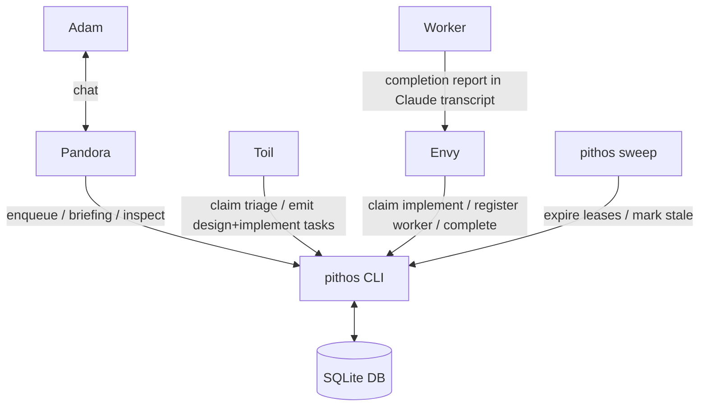
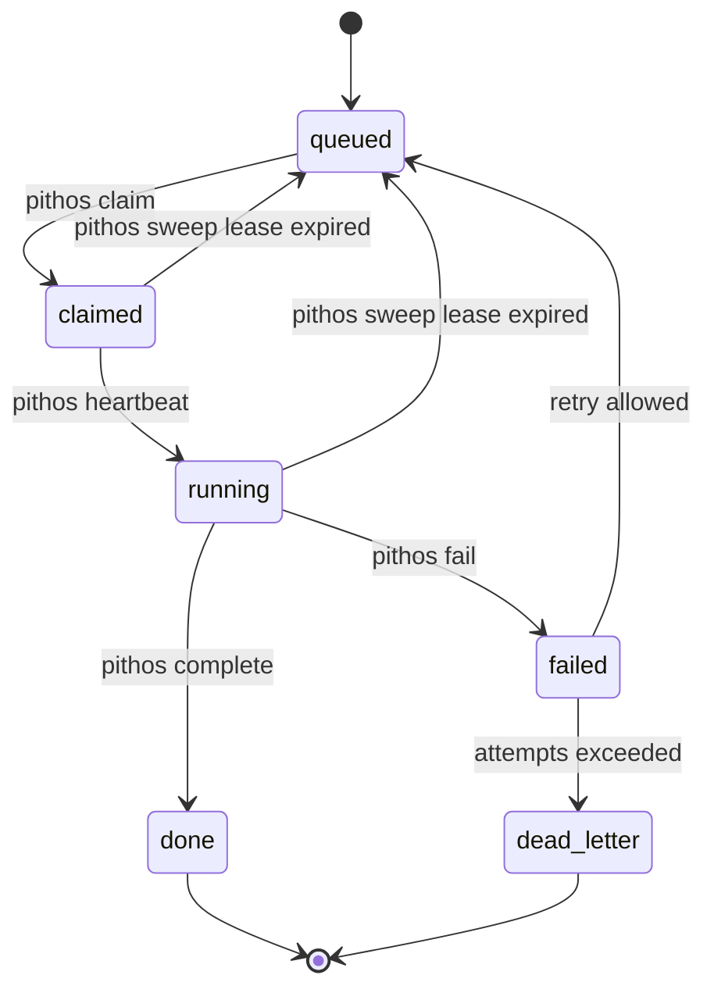

# Pandora Box MVP

**Status:** Partial  
**Last Updated:** 2026-05-03

## 1. Overview

### Purpose

Pandora Box is a small local control plane for coordinating Claude Code agents without making Pandora personally remember every task, worker, session, and stale process. It gives Pandora generated briefings, gives specialised agents a simple queue/lease API, and gives Adam a way to inspect or take over work when needed.

This is a from-scratch build in a new dedicated repository. Existing `pandora/bin/*` scripts and markdown workflows may be referenced for behaviour, but should not be treated as code to preserve.

### Goals

- Provide a central SQLite-backed task/run/event store.
- Provide a `pithos` CLI as the only supported API for agents and hooks.
- Let tasks be claimed atomically with leases and fencing tokens.
- Track Claude Code agent runs via lifecycle hooks and manual registration.
- Generate concise Pandora briefings from DB state.
- Support the first useful flow: Pandora or Toil enqueues work, Toil routes `triage` tasks, Greed can own `design` tasks, Envy claims `implement` tasks, delegates worker execution when needed, reports completion, and Pandora sees it in a briefing.
- Keep workers mostly isolated from Pandora Box; Envy/adapters translate worker status into DB artifacts.
- Keep recipes, Claude Code agent files, and Skills as configuration loaded at spawn time, not engine code.
- Keep prompts lean by relying on `pithos --help` and subcommand help for command details.

### Non-Goals

- No Dolt backend in MVP.
- No long-running `pithosd` daemon in MVP.
- No automatic agent spawning in MVP; agents are started manually or by simple wrappers.
- No full recipe engine in MVP; recipes are prompt/config context only.
- No persistent Death agent in MVP; deterministic cleanup belongs in `pithos sweep`.
- No attempt to replace Claude Code's session logs or tmux; store pointers and summaries.
- No repo-local `.pandora/` source of truth.
- No raw SQL access by agents.
- No giant system prompts that restate every command flag.

## 2. Design Decisions

- **Decision:** Build from scratch in a dedicated repo.
  - **Rationale:** Current scripts are useful prototypes but are coupled to the Obsidian vault and markdown mailboxes. A clean repo lets the control plane have its own tests, schema migrations, packaging, and lifecycle.

- **Decision:** Use SQLite for MVP rather than Dolt.
  - **Rationale:** The immediate need is a reliable local queue, event log, and lease store. SQLite gives atomic updates, low ops cost, and easy tests. Dolt can be reconsidered after the data model has proven useful.

- **Decision:** Expose all state mutation through `pithos`.
  - **Rationale:** Agents should not know DB schema or perform ad hoc writes. `pithos` enforces transitions, emits events, handles fencing, and allows the storage backend to change later.

- **Decision:** Start with `pithos sweep`, not `pithosd`.
  - **Rationale:** Lifecycle cleanup can initially run as a command from cron/launchd or manually. A daemon is only justified once wakeups/spawning need to be continuous.

- **Decision:** Use pull-based task claiming with leases.
  - **Rationale:** Agents and sessions crash. A leased claim lets work be safely reclaimed without requiring a reliable push bus.

- **Decision:** Use fencing tokens on task claims.
  - **Rationale:** If an expired agent wakes up after another run claimed the task, its stale completion must be rejected.

- **Decision:** Route work by scope and capability, not concrete agent, by default.
  - **Rationale:** Toil should be able to emit `repo:work/perkbox-services/protobuf + implement` or `... + design` without caring whether Envy, Greed, a future agent, or a human handles it. Direct addressing remains an exception for handoffs/debugging.

- **Decision:** Capability names describe the requested outcome class, not the agent's internal execution strategy.
  - **Rationale:** Queue-facing capabilities should answer what kind of work is being requested: `triage`, `design`, or `implement`. Envy may watch transcripts and delegate to workers internally, but that coordination style must not leak into claim matching as a queue capability such as `watch`. Likewise, recipe stage IDs such as `execute` are recipe-local names, not queue capability values.

- **Decision:** Scope IDs are home-relative addresses.
  - **Rationale:** Verbose scopes such as `repo:work/perkbox-services/protobuf` are unambiguous across repos while still being readable. They are derived from canonical paths under `$HOME`.

- **Decision:** Keep Toil, Greed, and Envy task-scoped or bounded by default.
  - **Rationale:** Short-lived agents naturally pick up new prompt/recipe config, avoid context bloat, and make failures smaller.

- **Decision:** Greed is specified but not required for the absolute MVP loop.
  - **Rationale:** Greed is essential for high-quality design work, but the smallest control-plane proof can run with Pandora, Toil, and Envy. Greed should be added as soon as the first design-heavy recipe needs it.

- **Decision:** Workers are pithos-tracked but not usually pithos-aware.
  - **Rationale:** Worker prompts should stay focused on implementation/research. Envy and wrapper scripts register worker runs, poll status, and post artifacts.

- **Decision:** Use TypeScript on Node LTS with pnpm workspaces, Effect v3, ESLint, and Vitest.
  - **Rationale:** Node LTS + pnpm is a stable base for a repo expected to grow. Workspaces keep future packages easy without adding much MVP cost. Effect gives typed configuration, errors, dependency injection, and service boundaries. Vitest is the test runner for all automated tests. Use stable Effect v3; avoid v4 beta/effect-smol for MVP.

- **Decision:** Keep command logic dependency-injected.
  - **Rationale:** DB, clock, IDs, filesystem, process execution, and Claude harness calls should be injectable so most tests are fast unit tests. Docker/Podman tests are e2e smoke for integration points, not detailed behaviour tests.

- **Decision:** ESLint bans `any`.
  - **Rationale:** Explicit `any` and unsafe inferred/leaked `any` should fail lint. Prefer `unknown`, tagged errors, schemas at boundaries, and typed fakes.

- **Decision:** Claude Code is the runtime harness for now.
  - **Rationale:** Claude Code already has session IDs, JSONL logs, tmux usage patterns, lifecycle hooks, named agents, and Skills. Pandora Box should wrap those capabilities rather than invent a full harness first.

- **Decision:** Use Claude Code agent files and Skills for role knowledge.
  - **Rationale:** Stable role prompts, tool lists, models, and preloaded Skills belong in versioned agent files. Runtime task context belongs in `--append-system-prompt`. Command details belong in `pithos --help`, not repeated in every prompt.

## 3. Architecture

### Component structure

Planned dedicated repo, likely `~/dev/pithos`:

```text
pithos/
  README.md
  CONTRIBUTING.md
  AGENT_LOOP.md
  AGENTS.md
  package.json
  pnpm-workspace.yaml
  eslint.config.js
  tsconfig.base.json
  packages/
    cli/
      package.json
      tsconfig.json
      bin/
        pithos
      src/
        cli/
        db/
        commands/
        render/
        claude-code/
      test/
        integration/
          container-db.test.ts
  recipes/
    protobuf-update.yaml
  .claude/
    agents/
      pandora.md
      toil.md
      envy.md
      greed.md
  skills/
    pithos-cli/
      SKILL.md
  hooks/
    claude-code/
      heartbeat
      session-start
      session-end
```

Default implementation choice for MVP is TypeScript on Node LTS with pnpm workspaces, Effect v3, ESLint, and Vitest, as detailed in `pandora-box-technical-design.md`. DB/CLI logic should not be shell-heavy.

### Data flow



### MVP task lifecycle



## 4. Data Model

The schema below is the MVP contract. Keep it boring. Add tables only when a real command cannot be represented with these rows plus JSON payloads.

### Database schema

```sql
CREATE TABLE schema_migrations (
  version INTEGER PRIMARY KEY,
  applied_at TEXT NOT NULL DEFAULT CURRENT_TIMESTAMP
);

CREATE TABLE scopes (
  id TEXT PRIMARY KEY,
  kind TEXT NOT NULL CHECK (kind IN ('global', 'repo', 'worktree')),
  name TEXT NOT NULL,
  canonical_path TEXT,
  metadata_json TEXT NOT NULL DEFAULT '{}',
  created_at TEXT NOT NULL DEFAULT CURRENT_TIMESTAMP,
  updated_at TEXT NOT NULL DEFAULT CURRENT_TIMESTAMP
);

CREATE TABLE tasks (
  id TEXT PRIMARY KEY,
  parent_id TEXT REFERENCES tasks(id),
  scope_id TEXT NOT NULL REFERENCES scopes(id),
  capability TEXT NOT NULL,
  status TEXT NOT NULL CHECK (status IN ('queued', 'claimed', 'running', 'done', 'failed', 'dead_letter', 'cancelled')),
  title TEXT NOT NULL,
  body TEXT NOT NULL DEFAULT '',
  payload_json TEXT NOT NULL DEFAULT '{}',
  lease_owner_run_id TEXT REFERENCES runs(id),
  lease_until TEXT,
  fencing_token INTEGER NOT NULL DEFAULT 0,
  attempts INTEGER NOT NULL DEFAULT 0,
  max_attempts INTEGER NOT NULL DEFAULT 3,
  result_json TEXT NOT NULL DEFAULT '{}',
  created_by_run_id TEXT REFERENCES runs(id),
  created_at TEXT NOT NULL DEFAULT CURRENT_TIMESTAMP,
  updated_at TEXT NOT NULL DEFAULT CURRENT_TIMESTAMP,
  completed_at TEXT
);

CREATE TABLE runs (
  id TEXT PRIMARY KEY,
  agent_kind TEXT NOT NULL,
  scope_id TEXT REFERENCES scopes(id),
  task_id TEXT REFERENCES tasks(id),
  parent_run_id TEXT REFERENCES runs(id),
  harness TEXT NOT NULL DEFAULT 'claude-code',
  session_id TEXT,
  tmux_target TEXT,
  cwd TEXT,
  status TEXT NOT NULL CHECK (status IN ('starting', 'running', 'idle', 'stale', 'ended', 'failed', 'cancelled')),
  last_heartbeat_at TEXT,
  last_hook TEXT,
  last_summary TEXT,
  metadata_json TEXT NOT NULL DEFAULT '{}',
  created_at TEXT NOT NULL DEFAULT CURRENT_TIMESTAMP,
  updated_at TEXT NOT NULL DEFAULT CURRENT_TIMESTAMP,
  ended_at TEXT
);

CREATE TABLE artifacts (
  id TEXT PRIMARY KEY,
  task_id TEXT REFERENCES tasks(id),
  run_id TEXT REFERENCES runs(id),
  kind TEXT NOT NULL,
  title TEXT NOT NULL,
  body TEXT NOT NULL DEFAULT '',
  metadata_json TEXT NOT NULL DEFAULT '{}',
  created_at TEXT NOT NULL DEFAULT CURRENT_TIMESTAMP
);

CREATE TABLE events (
  id INTEGER PRIMARY KEY AUTOINCREMENT,
  created_at TEXT NOT NULL DEFAULT CURRENT_TIMESTAMP,
  actor_run_id TEXT REFERENCES runs(id),
  task_id TEXT REFERENCES tasks(id),
  run_id TEXT REFERENCES runs(id),
  type TEXT NOT NULL,
  payload_json TEXT NOT NULL DEFAULT '{}'
);

CREATE INDEX idx_tasks_claimable ON tasks(scope_id, capability, status, lease_until);
CREATE INDEX idx_tasks_parent ON tasks(parent_id);
CREATE INDEX idx_runs_status ON runs(status, last_heartbeat_at);
CREATE INDEX idx_events_task ON events(task_id, id);
CREATE INDEX idx_events_created ON events(id);
```

## 5. Interfaces

### CLI commands

| Command               | Purpose                                                                    |
| --------------------- | -------------------------------------------------------------------------- |
| `pithos init`         | Create DB, migrations, default `global` scope                              |
| `pithos scope upsert` | Register global/repo/worktree scope                                        |
| `pithos run register` | Register a Claude Code/worker/agent run                                    |
| `pithos run end`      | Mark a run ended/failed/cancelled and append a lifecycle event             |
| `pithos heartbeat`    | Update mutable run heartbeat/last hook; optionally advance task to running |
| `pithos enqueue`      | Create queued task and event                                               |
| `pithos claim`        | Atomically claim one queued task for a run                                 |
| `pithos complete`     | Complete task if run owns current fencing token                            |
| `pithos fail`         | Fail task if run owns current fencing token                                |
| `pithos artifact add` | Attach completion report/design brief/status artifact                      |
| `pithos inspect`      | Inspect task/run/scope/artifact                                            |
| `pithos briefing`     | Render concise briefing for Pandora or a scope                             |
| `pithos tail`         | Show recent events                                                         |
| `pithos sweep`        | Expire leases, mark stale runs, requeue eligible tasks                     |

### Claim contract

`pithos claim` must be a single transaction. Conceptually:

```sql
UPDATE tasks
SET
  status = 'claimed',
  lease_owner_run_id = :run_id,
  lease_until = :lease_until,
  fencing_token = fencing_token + 1,
  attempts = attempts + 1,
  updated_at = CURRENT_TIMESTAMP
WHERE id = (
  SELECT id FROM tasks
  WHERE status = 'queued'
    AND scope_id = :scope_id
    AND capability = :capability
  ORDER BY created_at ASC
  LIMIT 1
)
RETURNING *;
```

`pithos complete` and `pithos fail` must require `--token` and reject stale tokens.

### Claude Code hooks

Use hooks only for lifecycle state in MVP:

| Hook               | MVP behaviour                               |
| ------------------ | ------------------------------------------- |
| `SessionStart`     | `pithos run register` if needed + heartbeat |
| `UserPromptSubmit` | heartbeat                                   |
| `PreToolUse`       | throttled heartbeat                         |
| `PostToolUse`      | throttled heartbeat                         |
| `Stop`             | heartbeat, optional last summary            |
| `StopFailure`      | event + heartbeat                           |
| `SessionEnd`       | `pithos run end`                            |
| `PreCompact`       | future: force handoff artifact              |

Heartbeats update `runs.last_heartbeat_at`; they should not append an event unless crossing a lifecycle boundary or failure/permission condition.

## 6. Implementation Phases

### Phase 1: local state and task lifecycle

- [ ] Create dedicated repo.
- [ ] Scaffold pnpm workspace with Node LTS TypeScript, Effect v3, ESLint, and Vitest.
- [ ] Add a basic Docker/Podman-compatible DB smoke test so local integration testing does not touch Adam's real sessions/state.
- [ ] Add fake-Claude harness seams for deterministic tests before any real-Claude container work.
- [ ] Keep real Claude-in-container tests out of the AFK MVP path until Adam is present for the first run; use `--model haiku` for that contract smoke.
- [ ] Implement migrations and SQLite connection.
- [ ] Implement `pithos init`.
- [ ] Implement `scope upsert`, `run register`, `run end`, `enqueue`, `claim`, `heartbeat`, `complete`, `fail`.
- [ ] Add tests for atomic claim and fencing-token rejection.

### Phase 2: visibility

- [ ] Implement `inspect task` and `inspect run`.
- [ ] Implement `tail`.
- [ ] Implement `briefing --agent pandora` with `as_of_event_id`.
- [ ] Add artifact support for completion reports.

### Phase 3: Claude Code integration

- [ ] Add minimal hook scripts calling `pithos heartbeat` / `run register`.
- [ ] Add wrapper or documented command to spawn a Claude Code run with `PITHOS_RUN_ID` and `claude --agent <name>`.
- [ ] Track worker session IDs and tmux targets.
- [ ] Reference existing `pandora/bin/status` behaviour when implementing run status lookup.

### Phase 4: sweep and first workflow

- [ ] Implement `pithos sweep` for expired leases and stale runs.
- [ ] Add one recipe/example and minimal agent files with Skills frontmatter for protobuf update/implement flow.
- [ ] Run manually with Pandora + one Envy + one worker.
- [ ] Record lessons before adding daemon/spawning automation or a real recipe engine.

## 7. Code Locations

Planned new dedicated repo:

| Path                                 | Change                                  |
| ------------------------------------ | --------------------------------------- |
| `~/dev/pithos/`                      | New repo for all implementation         |
| `pnpm-workspace.yaml`                | Workspace definition                    |
| `packages/cli/bin/pithos`            | CLI entrypoint                          |
| `packages/cli/src/db/`               | DB connection, transactions, migrations |
| `packages/cli/src/commands/`         | CLI command handlers                    |
| `packages/cli/src/render/briefing.*` | Markdown briefing rendering             |
| `packages/cli/src/claude-code/`      | Hook integration helpers                |
| `packages/cli/src/**/*.test.ts`      | File-adjacent unit tests (fake layers)  |
| `packages/cli/test/*.integration.test.ts` | Integration tests (real SQLite + CLI subprocess) |
| `packages/cli/test/integration/`     | Containerised DB smoke tests            |
| `hooks/claude-code/`                 | Shell wrappers for Claude Code hooks    |
| `recipes/`                           | Config-only workflow examples           |
| `.claude/agents/`                    | Claude Code agent files                 |
| `skills/`                            | Skills preloaded by agent frontmatter   |

Existing repo references only:

| Path                                         | Use                                            |
| -------------------------------------------- | ---------------------------------------------- |
| `pandora/bin/status`                         | Reference for Claude/Pi session status parsing |
| `pandora/bin/delegate`                       | Reference for spawning Claude/Pi workers       |
| `pandora/references/control-plane-sketch.md` | Design context                                 |

## 8. Resolved Decisions

- Implementation language/runtime: TypeScript on Node LTS with pnpm workspaces, Effect v3, ESLint, and Vitest.
- ESLint bans explicit `any` and unsafe `any` usage.
- Dedicated repo path/name: `~/dev/pithos`.
- CLI name: `pithos`.
- Scope IDs are home-relative, e.g. `repo:work/perkbox-services/protobuf`.
- `pithos run end` is a first-class lifecycle command.

## 9. Deferred Questions

- `pithos claim` should require exact capability only in MVP; multi-capability claiming can wait.
- `pandora/bin/status` should be prior art only; reimplement cleanly later if `pithos status` becomes necessary.
- Greed is v1.1 unless the first real workflow needs heavy design.
