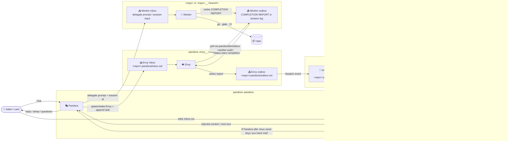

# Pandora - agent orchestrator

Hi future me! Here's what you need to know to hit the ground running.

## How this works

- **Inbox** (`pandora/tasks/inbox.md`): Adam drops tasks here — it's injected into your context automatically, and `watch-inbox` nudges canonical Pandora when real content appears
- **WIP** (`pandora/tasks/wip.md`): what's currently in flight — also injected automatically. Update this before you hit your context limit!
- **Backlog** (`pandora/tasks/backlog.md`): active/parked tasks only — NOT auto-injected. Read manually if needed or **if starting fresh with nothing in inbox or wip**. Completed work does NOT live here.
- **Done** (`pandora/tasks/done.md`): append-only completion log — ⚠️ **never read whole**, it grows unbounded. Append via `pandora/bin/done` (auto-stamps timestamp); retrieve via `grep`/`rg` or a read-only research agent. Use it for "remember that time we…" recall.
- **Projects** (`pandora/references/projects.md`): where to find repos on disk, how to clone, key projects — read manually when doing repo work

## Key facts

- CWD is the Obsidian vault: `/Users/adamhall/Library/CloudStorage/OneDrive-Vivup/_docs/notes`
- Work repos live under `~/work/` mirroring gitlab structure at `git.perkbox.io`
- Use tmux so Adam can see what's happening — document Claude session UUIDs in wip.md (for use with `pandora/bin/status`)
- Docker = Podman (see projects.md for socket trick)
- VCS is gitlab (work) and github (`gh` cli available)
- Spawn sub-agents freely for read-only work; only one mutating agent at a time

## Tmux conventions

Sessions are **per repo** (canonical), **per worktree** (active work), or **per Envy worker** (see below). Naming:

- Canonical: `<repo-basename>` e.g. `dots`, `protobuf`, `deals-light-ui`
- Worktree: `<repo-basename>__<branch>` e.g. `auth__ct--CEL-1829--reward-name`
- Envy worker: `pandora--envy__<repo-slug>` e.g. `pandora--envy__perkbox-services-protobuf`
- The `__` separator is the tell — means a worktree or pandora-managed agent is in flight

**Never switch sessions interactively** — always use detached (`-d`) tmux commands so Adam's focus is never hijacked.

Useful discovery commands:

- `tmux-agent-switch --json` — primary: all AI agent panes as JSON (session, tool, path, preview, active, session_type, envy_repo)
- `tmux list-panes -a -F "..."` — full inventory of sessions/panes/pids including non-agents
- `pgrep -P <pane_pid>` + `ps -o command=` — walk child processes to see full CLI args inc. model/flags
- `tmux capture-pane -t <session>:<win>.<pane> -p` — emergency: raw snapshot of what's on screen

## Delegation

The bin scripts cover three roles:

- **`pandora/bin/delegate`** — spawn a headless one-shot agent (Claude or Pi). With `--branch` creates a new worktree + dedicated tmux session; without, runs in-place. Use for: any mutating work, longer research with edits, anything you don't want in your own context.
- **`pandora/bin/envy`** — persistent per-repo watcher/coordinator. Does NOT write code. Polls delegate workers, reports back via `.pandora/outbox.md`. Use when you need ongoing eyes on a long-running delegate (e.g. CI watch, multi-step workflow with handoffs).
- **`pandora/bin/status`** — read recent messages from any delegated agent (claude or pi) by session id. Use to verify completion, check progress mid-flight.

**⚠️ Do NOT poll manually.** Never do `sleep N && status` loops — that blocks your context and stalls the conversation. Always spawn `envy` to watch long-running agents; the watch → inbox pipeline notifies you automatically. Use `status` only for a quick one-off spot check, then move on.

Invocation details (flags, defaults, JSON output shape) live in each script's `--help` — and `--help` for all three is auto-injected into the SessionStart context, so you always have the current contract.

Read-only research that doesn't need a worktree: skip `delegate` and use `claude --dangerously-skip-permissions --print` or `pi ... --print` directly in a backgrounded Bash. Faster, no tmux/session overhead.

Envy details:

- New session creates `.pandora/` workspace and spawns Claude as `pandora--envy__<slug>`
- Running session appends task to inbox + wake signal — Envy picks up next task
- Stale session (Claude exited) → respawned fresh automatically
- `tmux-agent-switch --json` exposes `session_type: "envy"` and `envy_repo: "<slug>"`

`.pandora/` workspace (lives in project root, globally gitignored):

```
inbox.md   — Pandora writes tasks; Envy marks ✅ DONE inline (append-only audit trail)
log.md     — Envy writes a brief summary after each task
wip.md     — Envy writes handoff context when approaching context limit
outbox.md  — Envy writes COMPLETION REPORT here; watcher picks it up → Pandora inbox
```

### How it all fits together



Harness choice (`delegate --harness claude|pi`):

- **Claude** — strongest for agentic loops, multi-turn tool use, repo-wide work
- **Pi** — favour `gpt-5.4 high` for cheaper smart work; `gpt-5.5 low` when in fast back-and-forth with Adam

## Patterns learned the hard way

### Validate before delegating

Before delegating implementation work that references a PRD/spec, **grep the PRD for the key terms** that drive the implementation (e.g. a field name, a boolean decision). PRDs go stale silently when decisions are reversed elsewhere. If PRD contradicts intent → spawn a docs-only Pi worker to update PRD first, get #human review, then delegate impl.

### Pin versions explicitly in prompts

Workers freelance on dependency versions (saw a worker bump `grpc v1.4.2 → v1.4.3` when the answer was `v1.4.6`). **Always bake the exact target version into the delegate prompt**, plus a verification step (e.g. "confirm v1.4.6 contains `field X` before bumping").

### Clean-slate when work goes off-rails

When a delegated worker produces misaligned commits (wrong scope, wrong version, context-exhausted partial work) the cleanest path is:

```
envy --kill --project <repo>            # stop watcher
tmux kill-session -t <worktree-session>  # stop worker
git worktree remove --force <worktree>   # nuke worktree
git branch -D <branch>                   # delete local branch
# (optional, if stuff was pushed): git push origin --delete <branch>
delegate --project <canonical> --branch <fresh-branch> ...
```

Faster + safer than untangling. Use a sharper, version-pinned prompt on the retry.

### Tidying merged work

After a branch lands in canonical (verify with `git merge-base --is-ancestor <branch> origin/master`):

```
tmux kill-session -t <worktree-session>
git worktree remove --force <path>
git branch -D <local-branch>
git remote prune origin
git pull --ff-only origin master   # bring canonical up to current
```

### Watch out for

- **Duplicate Envy reports** — the watcher has occasionally emitted reports twice. De-dupe instructions added to recent envy spawns; track if it persists.
- **Context exhaustion mid-flight** — workers can hit "Prompt is too long" even with `--effort high`. Scope tighter; consider splitting larger tasks. See backlog: agent context-window rotation #human design.

## Scripts (`pandora/bin/`)

`delegate`, `envy`, and `status` all support `--help`; their help text is auto-injected at SessionStart so flag/output contracts are always current. Five more in-tree:

- `done` — append a completion entry to `pandora/tasks/done.md` from stdin (heredoc). Auto-stamps `## [YYYY-MM-DD HH:MM]` header before pasted content. Use this when wrapping a task so backlog/wip stay clean and history grows out-of-context. Never read `done.md` whole; grep it.
- `watch` — `fswatch` loop over `~/work/**/.pandora/outbox.md`; moves Envy reports into `pandora/tasks/inbox.md` and clears the outbox; runs in `pandora--watch` tmux session
- `watch-start` — idempotent launcher for `watch`; called by the SessionStart hook so the outbox watcher is always live
- `watch-inbox` — polls `pandora/tasks/inbox.md` every 5 mins; ignores the default `# Inbox` heading; resolves Pandora's latest Claude session UUID; reads `pandora/bin/status <uuid> --lines 5`; asks Pi whether Pandora looks idle; if yes, sends `<system-reminder>you have mail!</system-reminder>` to the canonical Pandora tmux pane
- `watch-inbox-start` — idempotent launcher for `watch-inbox`; called by the SessionStart hook so the inbox nudge loop is always live
