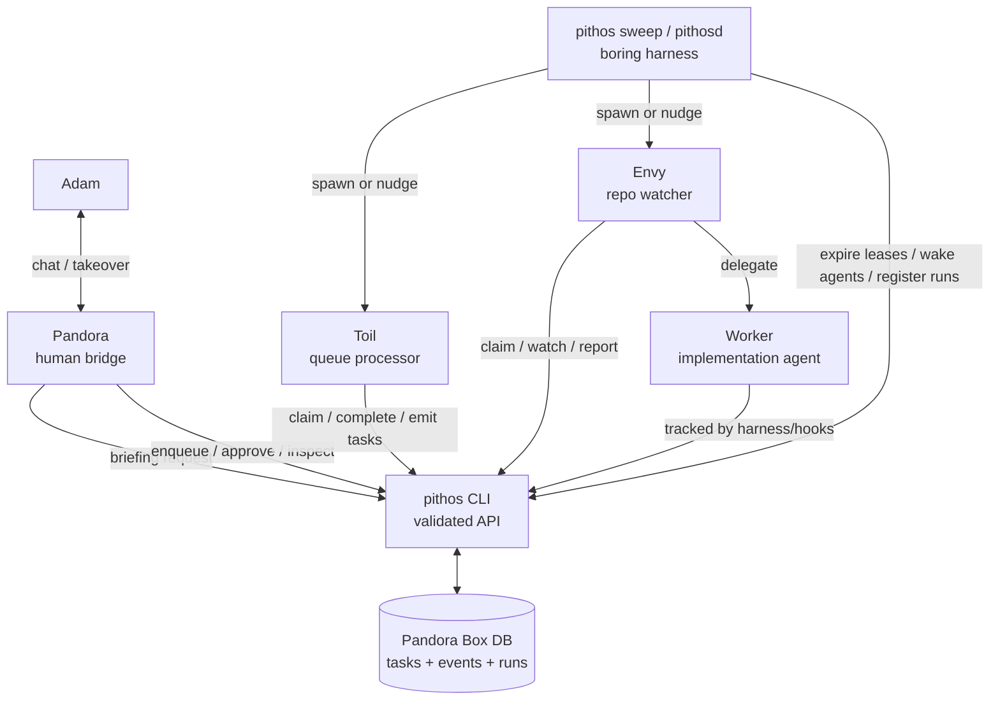
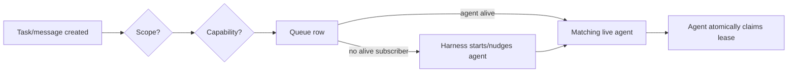
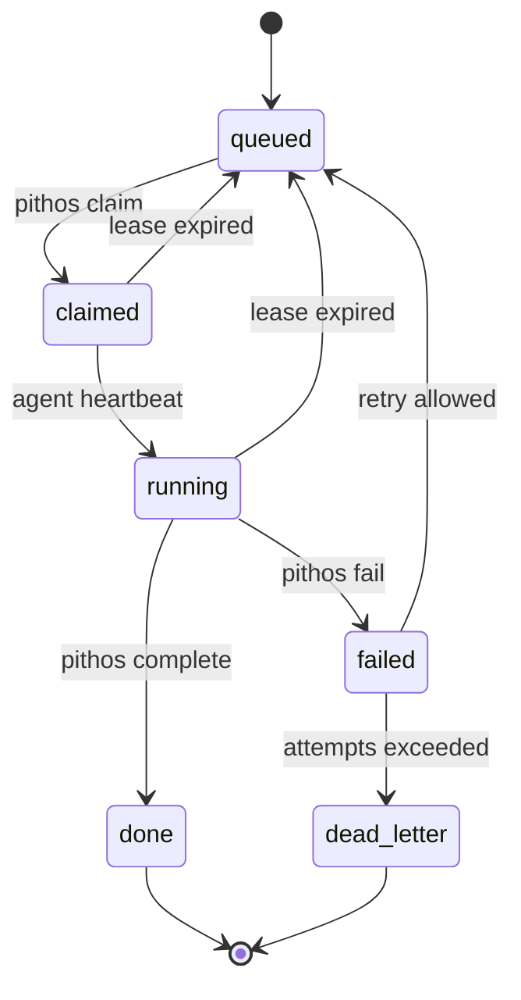
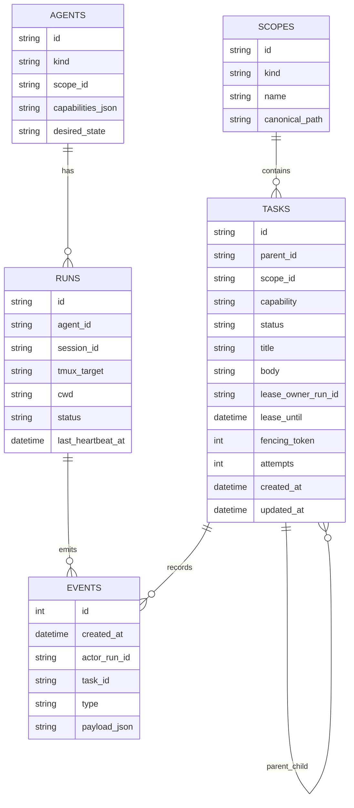
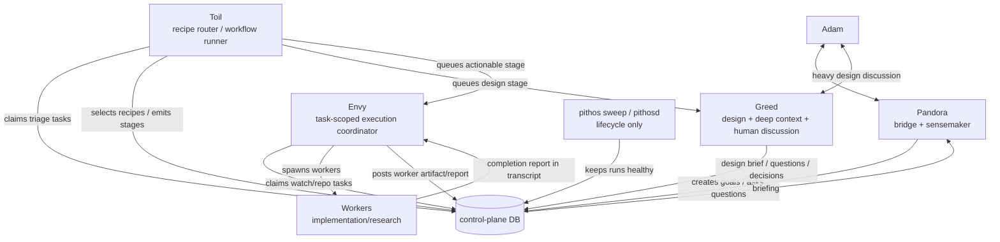
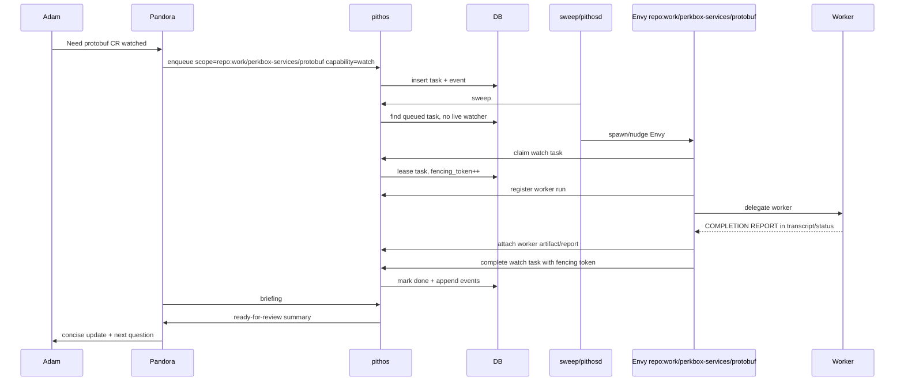

# Pandora control-plane sketch

## Design direction

Pandora is not a dark factory. Adam can inspect and talk to any agent, but the normal path is:

```text
Adam ⇄ Pandora ⇄ specialised evils ⇄ workers
```

The control-plane should make this visible, restartable, and auditable without making Pandora personally remember every queue, lease, and stale process.

## Final recommendation

Build a central Pandora Box control-plane with:

- **state DB** — durable tasks, events, agents, runs, leases
- **`pithos` CLI** — only supported API for agents and scripts
- **`pithos sweep` first, `pithosd` later** — boring lifecycle harness, no judgement
- **agents as reasoning engines** — Pandora, Toil, Greed, Envy, workers
- **scope + capability routing** — default messages target work domains, not named agents
- **recipes as configuration** — reusable workflows live outside engine code
- **Claude Code agents + Skills as configuration** — role knowledge lives in agent files/Skills, not spawn prompts
- **CLI help as contract** — agents use `pithos --help` / subcommand help for current mechanics
- **generated briefings** — Pandora reads summaries, not raw queues

Use repo-local `.pandora/` only for optional generated debug views or an address pointer. It must not be source of truth.

## DB choice

Two viable paths:

1. **SQLite v1, Dolt later** — simplest and safest for initial queue/lease semantics.
2. **Dolt v1** — reasonable if versioned state/history is a core requirement from day one.

Either way, agents must not write DB directly. They use `pithos`, so the backend can change.

Recommended first slice: implement against SQLite-shaped semantics, even if the backend is Dolt. Prioritise atomic claims, leases, events, and briefings over VCS cleverness.

## System overview



## Routing model

Default messages target a **scope** and **capability**, not a concrete agent.

```text
scope = global | repo:work/perkbox-services/protobuf | worktree:work/perkbox-services/protobuf__ct-feature
capability = triage | watch | implement | research | cleanup | brief
```

Example:

```bash
pithos enqueue \
  --scope repo:work/perkbox-services/protobuf \
  --capability watch \
  --title "watch worker abc" \
  --body "Report when session abc emits COMPLETION REPORT"
```

An agent registered as `envy` for `repo:work/perkbox-services/protobuf` and capability `watch` may claim it.

Direct addressing exists only for exceptions:

- human takeover
- explicit handoff to a known run
- replies to a parent agent
- debugging

## Scope/capability routing



## Task lifecycle

Use pull + leases, not push delivery.



Important correctness rule: every claim increments a **fencing token**. Completes/fails must include the token. If a stale agent finishes after its lease was reclaimed, its write is rejected.

## Minimal schema sketch



## Harness boundary

The harness is needed, but it should stay dumb.

For now, assume the runtime harness is **Claude Code**. Pandora Box should wrap Claude Code rather than replace it: spawn sessions with known IDs/environment, use named agents (`claude --agent <name>`), preload Skills via agent frontmatter, use hooks for lifecycle signals, and read Claude session logs/status when deeper inspection is needed.

### `pithos sweep` v1

Run every minute via launchd/cron:

- expire leases
- mark missing heartbeats stale
- requeue eligible work
- append lifecycle events
- optionally nudge tmux sessions

### `pithosd` v2

Only build when polling is not enough:

- maintain desired agents
- spawn missing agents
- wake sleeping agents
- supervise tmux/process state
- fan out notifications

No planning, prioritisation, or interpretation belongs in `pithosd`. Those are agent jobs.

## Claude Code lifecycle hooks

Claude Code hooks are part of the harness surface and should feed `pithos` lifecycle state.

| Hook                 | Pandora Box use                                                                             |
| -------------------- | ------------------------------------------------------------------------------------------- |
| `SessionStart`       | register/resume run, inject briefing/context, start local watchers if needed                |
| `SessionEnd`         | mark run ended/exited; append event if unexpected                                           |
| `UserPromptSubmit`   | heartbeat + record human/parent interaction timestamp                                       |
| `Stop`               | heartbeat; mark turn complete; optionally update last-response summary                      |
| `StopFailure`        | append failure event; keep run inspectable; maybe mark current task blocked if repeated     |
| `PreToolUse`         | lightweight heartbeat before work starts; useful for liveness during active turns           |
| `PostToolUse`        | heartbeat after potentially long-running tool call; optionally record salient tool metadata |
| `PostToolUseFailure` | append tool-failure event for debugging/retry policy                                        |
| `PermissionRequest`  | append attention-needed event; include requested tool/action                                |
| `PermissionDenied`   | append blocked/denied event                                                                 |
| `CwdChanged`         | update mutable run cwd/scope hints                                                          |
| `PreCompact`         | force checkpoint/handoff summary before context loss                                        |
| `PostCompact`        | record compacted/resumed event; refresh briefing if needed                                  |

### Heartbeat policy

Heartbeats should update mutable run state, not spam the append-only event log.

Recommended hook heartbeats:

- `SessionStart` — immediate heartbeat/register
- `UserPromptSubmit` — tells us the run has new input
- `PreToolUse` — frequent active-work heartbeat
- `PostToolUse` — covers long tool calls that may take minutes
- `Stop` / `StopFailure` — turn boundary heartbeat
- `SessionEnd` — final lifecycle update

Use throttling inside `pithos heartbeat`, e.g. only write if last heartbeat is older than 30–60 seconds unless the hook is a lifecycle boundary. This makes `PreToolUse` safe even when tools are frequent.

Do not commit/version every heartbeat if using Dolt. Commit meaningful lifecycle transitions and events; keep high-frequency heartbeat state mutable or batch it.

Workers can remain **not pithos-aware** while still being pithos-tracked: the Claude Code hook wrapper can heartbeat/register their run via environment such as `PITHOS_RUN_ID`, while the worker prompt stays focused on the implementation task.

## Agent roles



### Pandora

- primary human interface
- consumes `pithos briefing --agent pandora`
- asks Adam questions
- can enqueue goals or approve actions
- should not personally process raw queues

### Toil

- one-shot or bounded-run agent
- processes Pandora inbox/backlog/wip into structured tasks
- selects recipes and dispatches workflow stages
- queues Greed when design/context/human alignment is needed
- queues Envy when work is actionable
- hard cap on emitted tasks per run to avoid task spam
- should usually perish after dispatching one Pandora task or a small bounded batch

### Greed

- task-scoped design agent for deep repo/domain context
- expected to have heavy human-in-the-loop discussion with Adam
- prioritises code quality and shared understanding over speed
- explores code thoroughly, then asks focused questions one at a time until the design brief is clear
- produces design artifacts: implementation brief, impacted repos, risks, rollout plan, open decisions
- does not directly run the whole workflow; hands design output back to Toil/Pandora

This orchestration only matters if it improves the quality of code being built. Greed is the deliberate pressure valve: when a task needs thinking, shared context, or PRD/design refinement, the recipe should route to Greed before Envy/worker execution.

### Envy

- task-scoped by default, repo-scoped by context
- watches workers and repo tasks
- posts worker completion artifacts to DB
- completes its claimed task, then exits/perishes

Workers should usually be isolated from Pandora Box. Envy and the delegate wrapper register worker runs, poll/read their status, and translate their structured completion reports into DB artifacts/events. Ordinary workers should not need to know `pithos` exists.

### Death / cleanup

Do not start with Death as an LLM daemon.

Most cleanup is deterministic and belongs in `pithos sweep`:

- stale lease expiry
- dead run marking
- old tmux cleanup candidates

A future Death agent can review ambiguous cleanup decisions, but should not be required for basic lifecycle health.

## Recipes, Skills, and hot-reloaded agent templates

Recipes are reusable workflow definitions, not engine code. They describe how Toil should turn an incoming goal into stages, gates, and agent tasks.

Claude Code agent files define stable role prompts, model/tools, and preloaded Skills. Spawn prompts should stay small: use `--append-system-prompt` for runtime context and tell agents to run `pithos --help` / `pithos <subcommand> --help` for current command mechanics.

Examples:

- protobuf release across repos
- PRD to implementation
- multi-repo rollout
- CI failure investigation
- dependency upgrade chain

A recipe may require a heavy design stage:

```yaml
stages:
  - id: design
    agent: greed
    human_loop: heavy
    output: design_brief
    prompt_profile: grill-one-question-at-a-time
  - id: execute
    agent: envy
    depends_on: design
```

Agent prompts/templates and Skills are configuration loaded when a new run is spawned. Updating Greed's agent file or Skills should affect newly spawned Greed runs without engine changes. Existing running agents do not magically change; because Toil/Greed/Envy are task-scoped or bounded by default, the usual answer is to let them perish and spawn a fresh run. For urgent changes, mark old runs stale/cancelled and requeue.

This keeps experimentation cheap:

- update a recipe
- update Greed/Toil/Envy agent files or Skills
- new tasks use the new behaviour
- no core scheduler/database changes required

## Pandora briefing

Pandora should receive a generated briefing, not raw database rows.

```bash
pithos briefing --agent pandora
```

The briefing should include:

- urgent human questions
- ready-for-review work
- blocked/stale work
- new completion reports
- active repo tracks
- suggested next actions
- `as_of_event_id` watermark

The watermark matters: Pandora can tell whether its view is stale.

## Example sequence



## First implementable slice

Do not build the full daemon first.

1. Create central state DB.
2. Implement `pithos` commands:
   - `enqueue`
   - `claim`
   - `heartbeat`
   - `complete`
   - `fail`
   - `tail`
   - `briefing`
   - `sweep`
3. Support one or two scopes:
   - `global`
   - one repo scope
4. Manually run agents in tmux at first.
5. Use `pithos sweep` from cron/launchd every minute.
6. Only then add automatic spawn/nudge.

## Non-negotiable invariants

- Agents never mutate DB directly.
- Recipes and prompt templates are configuration, not engine code.
- New agent runs load current templates; running agents keep their existing context.
- Every important change emits an event.
- Claims are atomic.
- Completes/fails require current fencing token.
- Briefings include an event watermark.
- Repo-local `.pandora/` is generated/read-only or absent.
- Harness does lifecycle only; agents do judgement.
